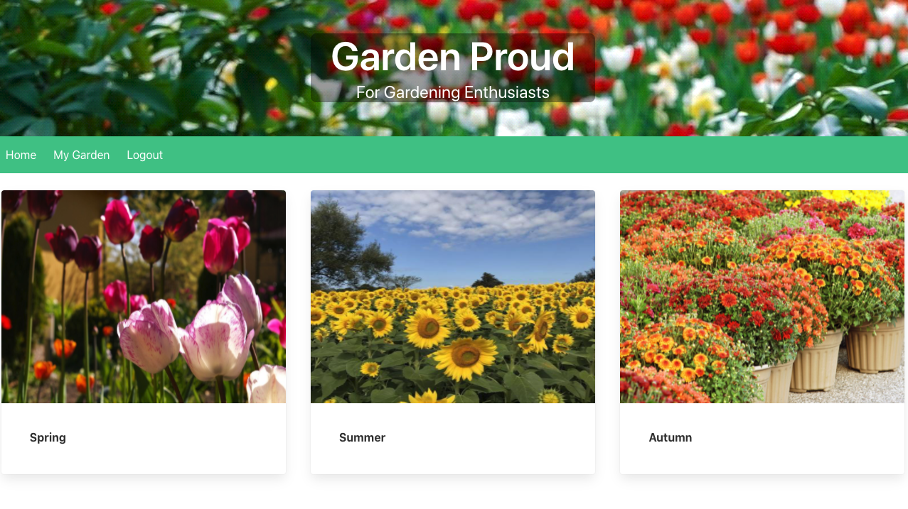
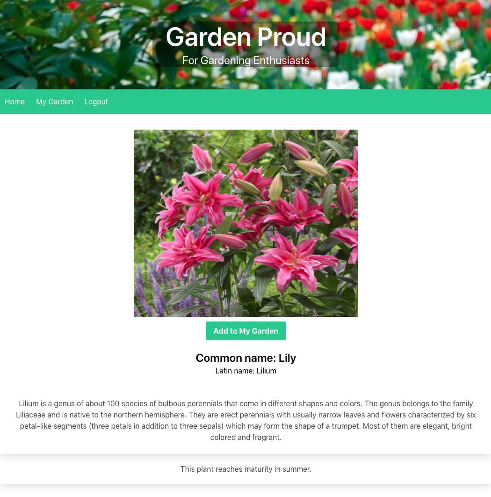
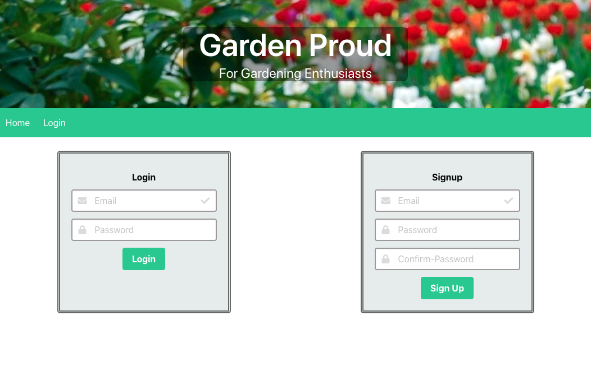
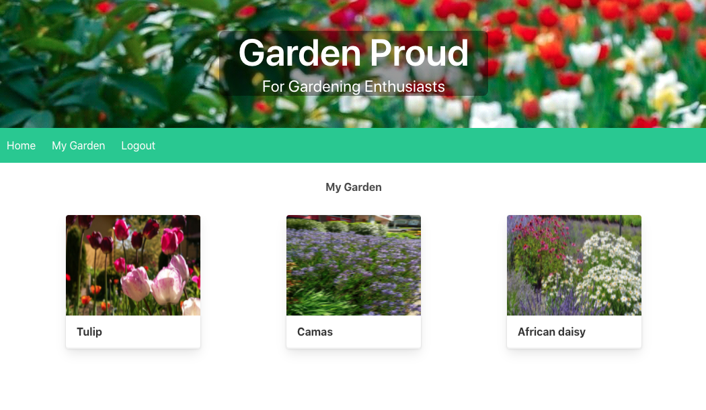

# Garden Proud

Developers: Ellie Dikova, Sahana Dinesh, Jonah Foster, Sydney Mercier  

For: UT Austin Coding Bootcamp

Deployed: [https://garden-proud-2022.herokuapp.com/](https://garden-proud-2022.herokuapp.com/)

# Table of Contents

* [Overview](#overview)
* [Development](#development)
* [Screenshots](#screenshots)
* [Contributing](#contributing)
* [Questions](#questions)

## Overview

Garden Proud is for gardening enthusiasts! Users have their own "gardens" on their profile that they can add plants and flowers to. Plants can be browsed by blooming season and saved with the click of a button on the individual plant's page. Only logged in users can add plants, but even non-members can browse plants and read their descriptions.

## Development

This app was made in Node, Express, MySQL, and Sequelize. Bulma and the npm package handlebars-helpers were used for the front-end.

## Screenshots

Below you can find images of the main application pages: Home page, Flower info page, User login / signup page and the Profile (MyGarden) page.  
 
  
 
  
 
  
 
  
 

## Contributing

If you want to contribute to this project, you can work on any open issue as well as add issues or recommendations via the app GitHub Issues tab.
If you want to have your fix or feature added, you will have to create and submit a PR for review.

## Questions
Any questions? You can reach the project team members via GitHub  
[Sydney](https://github.com/sygmo) 
[Sahana](https://github.com/sahanamai) 
[Jonah](https://github.com/JFoster97) 
[Ellie](https://github.com/boocipher) 